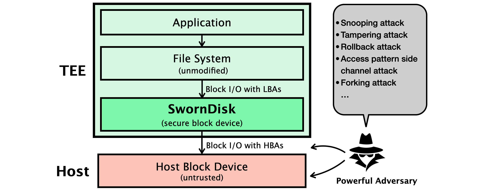

# What is JinDisk

JinDisk is a **log-structured secure block device for TEEs** that uses a *secure data log* to organize encrypted data blocks into segments for out-of-place updating and designs the *secure index* and *secure journal* to jointly protect the out-of-place updated on-disk data: the secure index is an enhanced [LSM-tree](https://en.wikipedia.org/wiki/Log-structured_merge-tree) which integrates an [Merkle Hash Trees (MHTs)](https://en.wikipedia.org/wiki/Merkle_tree) with a B+ tree for each of its immutable disk components to index the data log securely; and the secure journal is a chain of records which summarizes the persistence information of the data log and the index to achieve crash consistency.

# Motivation

[Trusted Execution Environments ](https://en.wikipedia.org/wiki/Trusted_execution_environment) protect sensitive code and data from untrusted infras-tructures. Modern TEEs can be classified into two categories: enclave-based TEEs (e.g., [Intel SGX](https://www.intel.com/content/www/us/en/architecture-and-technology/software-guard-extensions.html)) and VM-based TEEs (e.g., [AMD SEV](https://developer.amd.com/sev/)). Enclaves create isolated and encrypted memory regions in the address space of user-space processes, while VM-based TEEs apply isolation and memory encryption to protect a VM from a malicious hypervisor.

However, while the in-memory data can be protected from privileged adversaries by TEE hardware, the on-disk data still needs to be protected by TEE software. The state-of-the-art [SGX-PFS](https://www.intel.com/content/dam/develop/external/us/en/documents/overviewofintelprotectedfilesystemlibrary.pdf) uses MHTs to protect in-place updated on-disk data for TEEs, and adopts a recovery journal for crash consistency. Unfortunately, we find that SGX-PFS not only suffers from *poor random I/O performance* but also is vulnerable to a new attack type: an adversary can capture transient on-disk states (referred to as *unanticipated snapshots*, [CVE-2022-27499](http://cve.mitre.org/cgi-bin/cvename.cgi?name=CVE-2022-27499)) generated by cache eviction in the TEE, thus resulting in security loopholes.

# Security Goals

JinDisk consider a typical setting of TEE usage, where applications are ported into the TEE with no (or few) modifications thanks to a TEE-aware runtime. For Intel SGX, one popular choice for such a runtime is library OSes. For AMD SEV, one can choose off-the-shelf OS kernels like Linux. 

As shown in the image above, the runtime is to be integrated with JinDisk, which serves as a trusted logical block device that supports four standard block I/O commands including `read()`, `write()`, `flush()`, and `trim()`. JinDisk protects all block I/O through it *transparently*, and frees the rest of the TEE from worrying about the security of I/O and enables the reuse of existing I/O stacks.

To counter such a strong adversary, JinDisk aims to provide six security guarantees:
- *confidentiality*: guarantees that the user data submitted by any write is not leaked and thus prevents tampering attacks.
- *integrity*: promises that the user data returned from any read are genuinely generated by the user and thus prevents snooping attacks.
- *freshness*: ensures that the user data returned from any read are up-to-date and thus prevents rollback attacks.
- *anonymity*: prevents address mapping attacks by hiding LBAs. JinDisk hides the LBAs in that LBAs cannot be learned either from HBAs or from the on-disk data.
- *consistency*: ensures that all the security guarantees are held despite any accidental crashes or crashing attacks.
- *flush atomicity*: promises that all writes before a flush are persisted in an all-or-nothing manner.

# Architecture

As illustrated above, JinDisk organizes its data structures into four regions, of which (i) the data region stores the encrypted data log organized into segments (4MB); (ii) the index region stores the secure index of the data log based on an enhanced LSM-tree, which consists of a hierarchy of MHT-protected Block Index Tables (BITs); (iii) the journal region stores the journal records in a large ring buffer, which summarize the on-disk updates of the data log and index; and (iv) the checkpoint region contains auxiliary data structures that records JinDisk’s state for fast query and recovery. All data structures in the data index/journal regions are updated based on logging, while the data structures in the checkpoint region is updated in place.

JinDisk performs out-of-place data updates, where a write generates one data block (4KB), one or more index records (due to compaction), and one journal record. JinDisk minimizes the write amplification factor as follows: (i) logging for data avoids the high cost of protecting the entire block device with MHTs and allows us to use MHTs to only protect the much smaller index (i.e., the dsLSM-tree); (ii) the log structure of dsLSM-tree avoids the cascade of updates of MHTs as its disk components are immutable; and (iii) logging for the data/index allows the secure journal to only summarize the persistence information of the secure data log and dsLSM-tree. The net result is that the amplification factor is reduced from 2 × *H* of the traditional approach to 1 + *ε*, where *H* is the height of the MHT (proportional to the disk capacity) and *ε* ≪ 1.

# How to Use

This repository contains not only the Linux kernel module source of JinDisk, but also a setup-tool, which can help users to transform a plain raw disk into a encrypted JinDisk. You can refer to the corresponding documentations for more detailed instructions.

- `kernel-module`: the Linux kernel module source, only contains the [C implementation](kernel-module/c/README.md) now; however, the Rust one is also in the development process, which is based on the [Rust for Linux](https://github.com/Rust-for-Linux/linux) project.

- `setup-tool`: a utility (set) used to conveniently set up disk encryption based on the JinDisk. Refer to the README to configure and deploy a confidential VM image from the Guest Owner's perspective.
