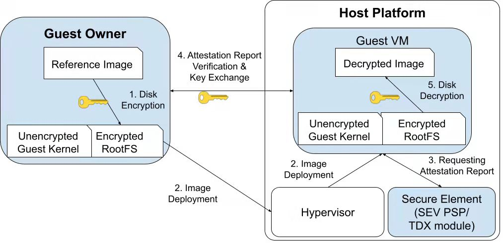

# Trusted startup of Encrypted VM image

This demo consists of source, scripts, and configuration files that can be used together to demonstrate how people can boot up a confidential virtual machine (VM) whose VM image is protected with JinDisk. It can help the user of a confidential computing cloud to transform his/her base image to an encrypted JinDisk image. And scripts are designed for the guest user to build a confidential VM image and to start up the confidential VM automatically.

Firstly, a general workflow of deploying a confidential VM image is presented from the Guest Owner's perspective. Here, the *Guest Owner* is the client in a VM-based TEE environment that would like to use the confidential computing cloud.
Then a step-by-step guide is given to show how the guest owner can prepare the encrypted image.

## High-level Workflow

The following diagram illustrates the high-level workflow and interdependencies between components.



The workflow of this demo can be described as five steps.

- Step 1: We use scripts to generate a protected guest image from a base image. Specifically, a new image that includes an EFI partition, a boot partition, and the most crucial one - a root partition is created. To safeguard the root partition (RootFS), it should be transformed into a JinDisk format using a pre-set disk encryption key. Additionally, necessary components (initramfs hooks, RA scripts, and other software dependencies) should be included to enable the guest VM startup.

- Step 2: The guest owner uses QEMU/KVM to launch a secure VM through a TEE-supported Hypervisor (such as QEMU/KVM). The Hypervisor will help calculate the measurement of the guest VM's kernel and report to the guest owner, ensuring that an expected VM image is launched.

- Step 3: The initramfs hooks request the attestation report when the kernel is booted. For example in AMD's SEV-SNP, a guest VM can make use of the SEV-SNP hardware to obtain an attestation report via the `sevguest.ko` and `ccp.ko` kernel modules ([CCP](https://lwn.net/Articles/735732/)). The `ccp.ko` module can optionally store the VCEK certificate for the platform along with the certificate chain necessary to validate the VCEK certificate. This guest kernel driver is also responsible for sending the `SNP_GUEST_REQUEST` message to the ASP firmware and presenting the reply back to the user space. Intel TDX also provides similar measurements (just like SEV's attestation report) for the guest owner to verify.

- Step 4: The initramfs hooks send the attestation report to the guest owner or a key server. If the verification is passed, a trusted communication channel can be built. The cryptographic key to decrypt the root partition is retrieved by the guest VM.

- Step 5: The initramfs hooks decrypt the guest VM's root filesystem with the key. Before unlocking, the root partition should be mounted automatically during the kernel boot. Then, the pre-installed initramfs hooks invoke the functionalities in the `jindisksetup` automatically to open the JinDisk-formatted root partition. 

## Step-by-step Workflow

Some processes (e.g. installing and launching the virtual machine) are expected to be done on the host (i.e. outside the VM) while others (such as installing JinDisk into initramfs) are best done within the guest VM.

### Environment settings

Preparing a TEE-equipped host is the prerequisite.
Taking SEV-SNP as an example, to deploy and test a confidential guest VM using QEMU, check the [sev-snp-installation.md](../../docs/sev-snp-installation.md) in the docs directory.
For standard instructions to build SEV and SEV-ES kernels, check the `master` branch of the [AMDSEV repository](https://github.com/AMDESE/AMDSEV). For instructions to build SEV-SNP kernels, see the `sev-snp-devel` branch.

### Preparing the reference image (out-of-VM)

The scripts in [out-of-VM](./out-of-VM/) directory can be used to prepare a blank Qcow2 image as a base. Kernel modules such as CCP and dm-jindisk as well as other dependent software packages can be installed into the image later. 

First, prepare a clean guest VM. Ubuntu 22.04 is recommended.

```bash
wget https://releases.ubuntu.com/22.04/ubuntu-22.04.1-live-server-amd64.iso
```

A 50+ GB disk image is preferred.

```bash
qemu-img create -f qcow2 ubuntu-22.04-ref.qcow2 50G
```

Then, [install the guest VM](https://ubuntu.com/server/docs/installation) using the downloaded ISO.
After the installation is complete, reboot the guest VM and check if the installation was successful. This time remove the `-boot dc` argument and detach the ISO drive.

Download JinDisk along with the demo.

```bash
git clone git@github.com:jinzhao-dev/jindisk.git
cd jindisk
cd demos/encrypted-VM-image
```

After setting environment variables, launch the reference image (the clean image that is deployed from the Ubuntu ISO) using the [startup-ref.sh](./out-of-VM/startup-ref.sh) script to do so. Set the configurations in the [env.sh](./out-of-VM/env.sh) and the `startup-ref.sh` before launching the guest VM. 

```bash
cd out-of-VM
sudo ./startup-ref.sh
```

Feel free to modify this bash script to customize your own VM. 
To launch a SEV-SNP guest, a QEMU argument has to be added: `-object sev-guest,id=sev0,cbitpos=51,reduced-phys-bits=1`. 
And note that the params of `OVMF_CODE`/`OVMF_VARS` (virtual firmware) for SEV passed to the QEMU should be different from the ones on Intel TDX hosts.

When starting the reference VM, a blank Qcow2 image will be created and attached for being transformed into a JinDisk-encrypted image later. If not specified, the output file name will be the `new_image` by default, and the size will be the `DEFAULT_IMG_SIZE` which can be set in the [env.sh](./out-of-VM/env.sh). 

### Installing JinDisk (in-VM)

Connect and log on to the guest VM via SSH. 

```bash
sudo ssh -p 10086 your_username@localhost
```

Right after starting up and logging on to the reference VM, install the JinDisk (the `jindisksetup` binaries and the `dm-jindisk` kernel module) in the initramfs first. To do that, simply run the [install-user-cli.sh](./in-VM/setup-scripts/install-user-cli.sh) and the [install-kernel-module.sh](./in-VM/setup-scripts/install-kernel-module.sh) inside the guest VM.

```bash
git clone git@github.com:jinzhao-dev/jindisk.git
cd jindisk
cd demos/encrypted-VM-image/in-VM/setup-scripts
sudo ./install-kernel-module.sh
sudo ./install-user-cli.sh
```

You may have to reinstall the Linux kernel when installing JinDisk kernel module. Refer to its [README](../../kernel-module/c/README.md) for more details. And you can also refer to the [README](../../user-cli/README.md) for the installation of JinDisk user-space CLI.

### Assembling the new JinDisk image (in-VM)

**Note that it is recommended to use an in-VM approach to generate a JinDisk-encrypted image, which assembles the image in a virtual machine. It has proved to be faster than generating it on a non-virtualized host (like what the [official SEV-SNP end-to-end remote attestation example](https://github.com/AMDESE/sev-guest) does). Also, the in-VM way has fewer compatibility issues.**

After the kernel module and user-space tool are installed, you can start to prepare the JinDisk-encrypted image. The [in-VM](./in-VM/) directory stores the scripts that should be running inside a VM, where you can use the [assemble.sh](./in-VM/assemble.sh) to create the new JinDisk-encrypted image. Encrypted partitions will be created and initramfs hooks will be placed.

```bash
cd ..
sudo ./assemble.sh
```

Once the `assemble.sh` script is executed successfully, you will see three partitions have been built on the virtual disk (`/dev/sdb`) of the new image, including a boot partition, an EFI partition, and a JinDisk RootFS partition. Then, shut down the reference VM and log off for launching the newly-created image later.

### Launching the new JinDisk-encrypted guest-VM (out-of-VM)

Once you've done all the above-mentioned preparation, the last step is to start up and verify the new image. 

```bash
sudo ./startup-new.sh
```

## Compatibility and Security

This demo has been tested on Ubuntu 20.04/22.04 as the guest OS, with Linux 5.15 and 5.17 as the guest VM's kernel. Other versions may work but are not guaranteed.

Architectural discussions and security considerations are available in the [docs](../../docs/) directory. To better understand the rationale and security implications behind it, consult [security-considerations.md](../../docs/security-considerations.md) in docs.


## Future Work

Future updates to this demo will include additional examples of how to perform RA on TEE platforms like Intel TDX.
