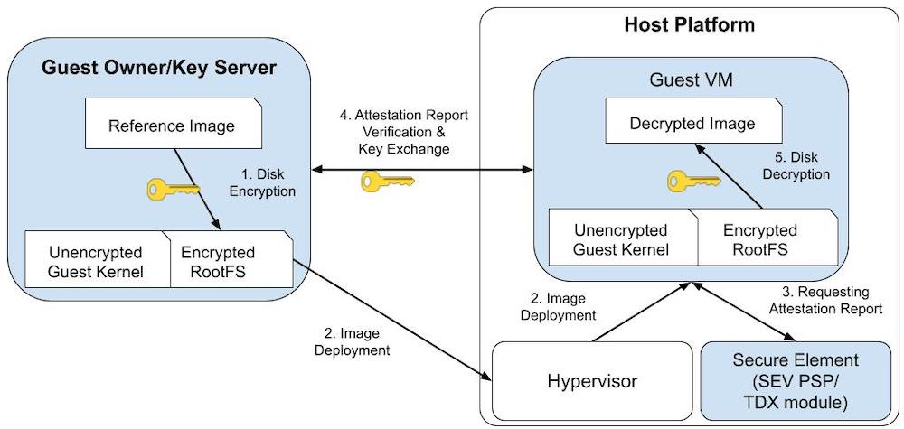

# Trusted startup of Encrypted VM image

This demo shows how one can start up a [confidential virtual machine (CVM)](https://cloud.google.com/compute/confidential-vm/docs/about-cvm) whose VM image is protected with JinDisk. It provides tools that (1) can convert a plain virtual machine (VM) image into a JinDisk-protected one and (2) can use a JinDisk-protected VM image to start up a confidential VM. During the VM startup, a customizable process of remote attestation is triggered to fetch the root key that can unlock the JinDisk-protected VM image.

The demo presents how to build and deploy a JinDisk-encrypted image on both Intel TDX and AMD SEV, while users can experiment with the demo without any VM-based TEE support.

## High-level Workflow



The workflow of this demo can be described as the following steps.

- Step 1: Create a JinDisk-protected VM image from a base image. Specifically, a new VM image that includes an EFI partition, a boot partition, and the most crucial one - a root partition is created. The root partition (RootFS) should be transformed into the JinDisk format using a predetermined disk encryption key. Necessary components (initramfs hooks, RA scripts, and other software dependencies) will be included into the new image to enable the subsequent guest VM startup.

- Step 2: The guest owner uses a TEE-supported Hypervisor (such as QEMU/KVM) to initiate a secure VM. Here, the *Guest Owner* is the client in a VM-based TEE environment that would like to use the confidential computing cloud.

- Step 3, 4, and 5: The hooks inside the initramfs request the attestation report and sent it to the guest owner/key server when the kernel is booted. If the verification is passed, a trusted communication channel can be built and the key to decrypt the root partition is retrieved by the guest VM. The initramfs hooks then decrypt the guest VM's root filesystem with the key.

## Step-by-step Instructions

### Environment settings

If one just intends to test the functionalities of JinDisk through this demo, this step may be skipped. However, if running the demo on a TDX or an SEV-SNP machine, it is imperative to have a TEE host system in place. The TEE host system requires the installation of essential software including QEMU, OVMF, and a patched Linux kernel.

*A warning here: this demo represents the state of the art and includes patches that are certainly not deployed in distributions and may not even be upstream, so anyone follows along at home will need to patch things like QEMU, Grub, and OVMF as below.*

For Intel TDX, 
*Todo: add installation instructions to install TDX-compatible QEMU/TDVF*

For AMD SEV-SNP, the following commands build the SEV-compatible QEMU/OVMF used for launching an SEV-SNP guest VM.

```bash
cd ~
git clone https://github.com/AMDESE/AMDSEV.git
git checkout sev-snp-devel
./build.sh --package
sudo cp kvm.conf /etc/modprobe.d/
```

On succesful build, the binaries will be available in `~/AMDSEV/snp-release-<DATE>/`.

Check [Intel TDX's whitepaper](https://software.intel.com/content/www/us/en/develop/articles/intel-trust-domain-extensions.html) and [AMD SEV-SNP's Github repository](https://github.com/AMDESE/AMDSEV/tree/sev-snp-devel) for more details to deploy and bring up a confidential guest VM.


### Preparing the reference image

A JinDisk-installed VM image can be downloaded via the following commands.

```bash
cd ~
docker pull liuweijie/jindisk-vm-image:ubuntu-20.04
docker run -d --name "encrypted-image-demo" liuweijie/jindisk-vm-image:ubuntu-20.04
docker cp encrypted-image-demo:/home/ubuntu-20.04-jinzhao-disk.qcow2 .
```

Anyone can create their own customized image which includes TEE-specific kernel modules and other tailored software packages if desired. Nonetheless it is worth noting that this demo at present can only convert Ubuntu-based images.

### Assembling the new JinDisk-encrypted image

Once the image is ready, the [qemu-create-jindisk-image.sh](./qemu-create-jindisk-image.sh) script can be used to create the new JinDisk-encrypted image using the above-mentioned reference image as a base. Encrypted partitions will be created and initramfs hooks will be placed.

Invoke the `qemu-create-jindisk-image.sh` script to create a new QCOW2 image file called `ubuntu-20.04-new-jindisk.qcow2`, and resize it to 60GB.
This command assumes that a QEMU executable is located at `~/AMDSEV/snp-release-<DATE>/usr/local/bin/qemu-system-x86_64` if the AMD SEV-SNP is enabled on the host. Feel free to change it to a customized version (e.g., a TDX-compatible QEMU) if necessary.

```bash
sudo ./qemu-create-jindisk-image.sh 
    -qemu         ~/AMDSEV/snp-release-<DATE>/usr/local/bin/qemu-system-x86_64 \
    -ref          ~/ubuntu-20.04-jinzhao-disk.qcow2 \
    -new          ~/ubuntu-20.04-new-jinzhao-disk.qcow2 \
    -size         60G \
    -mem          8 \
    -smp          16G
```

### Launching the new VM and unlocking the JinDisk-encrypted image

Use the [qemu-launch-secure-vm.sh](./qemu-launch-secure-vm.sh) script to launch a secure VM and to verify whether the image is created successfully.
Specify an SSH port or a VNC port to connect to the new VM via SSH or VNC, respectively. The command assumes the OVMF is located at `~/AMDSEV/snp-release-<DATE>/usr/local/share/qemu/`. Use `-tee` to specify which TEE guest is expected to be launched. For example in the following command, the last argument `-tee sev` will force the QEMU to start up an SEV guest VM.
*Todo: add support in the script to launch a TD*

```bash
sudo ./qemu-launch-secure-vm.sh \
    -qemu         ~/AMDSEV/snp-release-<DATE>/usr/local/bin/qemu-system-x86_64 \
	-hda          ubuntu-20.04-new-jinzhao-disk.qcow2 \
	-mem          8 \
	-smp          16G \
	-ssh          10086 \
	-vnc          1 \
	-uefi_code    ~/AMDSEV/snp-release-<DATE>/usr/local/share/qemu/OVMF_CODE.fd \
	-uefi_vars    ~/AMDSEV/snp-release-<DATE>/usr/local/share/qemu/OVMF_VARS.fd \
    -tee sev
```

Once logged onto the VM, run the `lsblk` command inside the VM. A JinDisk-formatted block device mounted as the RootFS will be listed if the instructions have been followed correctly.


## Future Work

The forthcoming updates to this demo will include additional examples of performing RA on VM-based TEE platforms.

At present the retrieval of disk decryption in this demo is done locally from the initramfs without resorting to remote attestation.
However it is imperative and feasible to integrate remote attestation protocols at this stage by embedding scripts into the initramfs hooks. 
By replacing the [getting key script](./in-vm/initramfs-hooks/getting_key.sh) one can obtain the **attestation report** and exchange it with the guest owner/key server.
Both Intel TDX and AMD SEV offer attestation reports to the guest owner for verification purposes.

Specifically in Intel TDX, the guest VM (aka. the trust domain, TD) can request a TDREPORT which is locally MAC’d and used to generate a quote via a quoting enclave (QE). The guest owner can verify the quote to further verify the trustworthiness of the TD. 
To integrate TDX's RA into the demo, 
*Todo: add more details about Intel TDX's remote attestation*

In AMD's SEV-SNP, a guest VM can use the SEV-SNP hardware to procure a signed attestation report via the `sevguest.ko` and the `ccp.ko` modules. The [ccp.ko](https://lwn.net/Articles/735732/) module can store the VCEK certificate for the platform along with the certificate chain necessary to validate the VCEK certificate. This guest kernel driver is also responsible for sending the `SNP_GUEST_REQUEST` message to the ASP firmware and presenting the reply back to the guest VM's user space.
Therefore to integrate SEV-SNP's RA into the demo the initramfs should include a proxy program that can be called by the `getting key script`. The proxy program should query the attestation report from the `/dev/sev-guest` device inside the SEV-SNP guest VM and then send the report to the verifier (the guest owner/key server). This will establish a trusted channel between the guest VM and the verifier allowing them to exchange the disk decryption key securely.


## Compatibility and Security

This demo has been tested on Ubuntu 20.04/22.04 as the guest VM's OS, with Linux 5.15/5.17 as the guest VM's kernel. Other versions may work but are not guaranteed.

Architectural discussions and security considerations are available in the [docs](../../docs/) directory. To better understand the rationale and security implications behind it, consult [security-considerations.md](../../docs/security-considerations.md) in docs.
