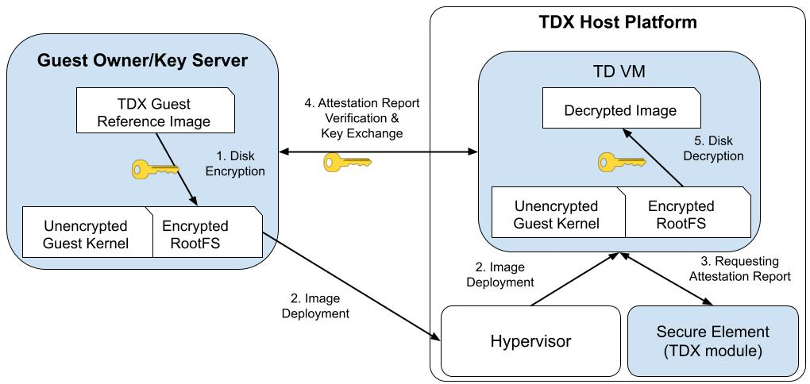

# Trusted startup of Encrypted VM image

This demo shows how one can start up a confidential TDVM whose TDVM image is protected with JinDisk. It provides tools that (1) can convert a plain TD virtual machine (VM) image into a JinDisk-protected one and (2) can use a JinDisk-protected VM image to start up a confidential VM. During the VM startup, a customizable process of remote attestation is triggered to fetch the root key that can unlock the JinDisk-protected VM image.

This demo is intended for Intel TDX, although it is also runnable on non-TEE VMs (with weaker security guarantees, of course).

## High-level Workflow



The workflow of this demo can be described as the following steps.

- Step 1: Create a JinDisk-protected TDVM image from a base image. Specifically, a new TDVM image that includes an EFI partition, a boot partition, and the most crucial one - a root partition is created. The root partition (RootFS) should be transformed into the JinDisk format using a predetermined disk encryption key. Necessary components (initramfs hooks, RA scripts, and other software dependencies) will be included into the new image to enable the subsequent guest VM startup.

- Step 2: The guest owner uses a TDX-supported Hypervisor (such as QEMU/KVM) to initiate a secure TDVM. Here, the *Guest Owner* is the client in a TDVM-based TDX environment that would like to use the confidential computing cloud.

- Step 3, 4, and 5: The hooks inside the initramfs request the attestation report and sent it to the guest owner/key server when the kernel is booted. If the verification is passed, a trusted communication channel can be built and the key to decrypt the root partition is retrieved by the TDVM. The initramfs hooks then decrypt the TDVM's root filesystem with the key.

## Step-by-step Instructions

A step-by-step guide is given here to show how the guest owner can create the JinDisk-protected TDVM image and unlock the image during startup. All commands in this guide are to be executed on the host machine if not specified otherwise.

### Environment settings

If one just intends to test the functionalities of JinDisk through this demo, this step may be skipped. However, if running the demo on a TDX machine, it is imperative to have a TDX host system in place. The TDX host system requires the installation of essential software including QEMU, OVMF, and a patched Linux kernel.

*A warning here: this demo represents the state of the art and includes patches that are certainly not deployed in distributions and may not even be upstream, so anyone follows along will need to patch things like QEMU, Grub, and OVMF as below.*

Check [Intel TDX's Linux Stack](https://cczoo.readthedocs.io/en/latest/TEE/TDX/tdxstack.html) and [Intel TDX Documents](https://cczoo.readthedocs.io/en/latest/TEE/TDX/inteltdx.html) for more details to deploy and bring up a TDVM.


### Preparing the reference image

A reference image must include the JinDisk driver and the corresponding components. 
Anyone can prepare their own customized image which includes TEE-specific kernel modules and other tailored software packages if desired. Nonetheless it is worth noting that this demo at present can only convert Ubuntu-based images.

Download jindisk source code:

```bash
mkdir -p /home/jindisk && cd /home/jindisk
git clone https://github.com/jinzhao-dev/jinzhao-disk.git
```

One option is to download a pre-installed TDVM image.
For example, a TD image (equipped with JinDisk) can be downloaded via the following commands.

```bash
cd /home/jindisk
docker pull intelcczoo/encrypted-tdvm-img:jindisk
docker run -d --name "encrypted-image-demo" intelcczoo/encrypted-tdvm-img:jindisk
docker cp encrypted-image-demo:/home/td-guest-ubuntu-22.04-jindisk-img.zip .
unzip td-guest-ubuntu-22.04-jindisk-img.zip && rm td-guest-ubuntu-22.04-jindisk-img.zip
```

Or one can manually install the driver and components on a clean image from scratch using the [JinDisk kernel module installation](./in-vm/installation-scripts/install-kernel-module.sh) script and the [Jindisk user CLI installation](./in-vm/installation-scripts/install-user-cli.sh) script.


### Assembling the new JinDisk-encrypted image

Once the reference image is ready, one can assemble the new JinDisk-encrypted on different TEE platforms.

For TDX, you should apply certain patches and use the following commands to build the new image.

```bash
cd /home/jindisk/jinzhao-disk/demos/encrypted-vm-image/in-vm/TDX
git am 0001-Add-TDVM-Encrypted-image-boot.patch
```

Copy above new patched jindisk source code to reference TDVM image:

```bash
cd ..
./copy-into-image.sh -src /home/jindisk/jinzhao-disk -image /home/jindisk/td-guest-ubuntu-22.04-jindisk.qcow2 -dest /home/
```

*Note:* Please update the `IP address` of machine running `ra-server` in the file `TDX/ra-client/etc/hosts`.

Invoke the `qemu-create-jindisk-image.sh` script to create a new QCOW2 image file called `ubuntu-20.04-new-jindisk.qcow2` with the `-new` option, and resize it to `60GB`. And it will boot into the reference image.
Note that this command assumes that a QEMU executable is located at `/usr/libexec/qemu-kvm` if the TDX is enabled and TDX Linux stack is installed on the host.

*Need Update with Weijie new update of the script*
```bash
sudo ./qemu-create-jindisk-image.sh 
    -qemu         /usr/libexec/qemu-kvm \
    -ref          /home/jindisk/td-guest-ubuntu-22.04-jindisk.qcow2 \
    -new          /home/jindisk/encrypted-td-guest-ubuntu-22.04.qcow2 \
    -size         60G
```
*Note:* The TDVM image user/password is root/123456.

After booting into reference TDVM, make the encrypted TDVM image as below:

```bash
cd /home/jinzhao-disk/demo/encrypted-vm-image/in-vm
./assemble.sh
```

It will show "Encrypted Image Successfully created" when the encrypted image is made.
Then return the host and you should find the image `encrypted-td-guest-ubuntu-22.04.qcow2`.

### Launching the attestation/key service

To decrypt a non-TEE VM, the key can be located at the initramfs or can be input by the user manually. Therefore, the service is not required.

For TDX, suppose the TDX Linux stack is already installed and configured correctly to support TDX remote attestation.

```bash
cd /home/jindisk/jinzhao-disk/demos/encrypted-vm-image/in-vm/TDX/ra-server
http_proxy= https_proxy= HTTP_PROXY= HTTPS_PROXY= GRPC_DEFAULT_SSL_ROOTS_FILE_PATH=./roots.pem ./ra-server -host=0.0.0.0:50051 -cfg=dynamic_config.json -s=secret.json
```

*Note:*
1. The port of the remote attestation service is 50051.
2. The secret key (the value should be the same as "preset_key" in assemble.sh) is stored in secret.json file, user reset the key as needed.
3. Please refer to the source code of `ra-server` [here](https://github.com/intel/confidential-computing-zoo/tree/main/cczoo/tdx-encrypted-vfs/get_secret). 

### Launching the new VM and unlocking the JinDisk-encrypted image

In a non-TEE environment, one can use the [qemu-launch-secure-vm.sh](./qemu-launch-secure-vm.sh) script to launch a secure VM and to verify whether the image is created successfully.
Use the `-hda` option to specify the image file. The command assumes the OVMF is located at `~/AMDSEV/snp-release-<DATE>/usr/local/share/qemu/`. Use `-tee` to specify which TEE guest is expected to be launched. For example in the following command, the last argument `-tee sev` will force the QEMU to start up an SEV guest VM. A normal VM will be launched if the `-tee` option is not specified.
Utilize the command line options `-mem`, `-smp`, `-ssh`, and `-vnc` to specify the virtual machine's allocated memory capacity, count of virtual CPU cores assigned, as well as the respective ports for SSH and VNC communication channels.


```bash
sudo ./qemu-launch-secure-vm.sh \
    -qemu         ~/AMDSEV/snp-release-<DATE>/usr/local/bin/qemu-system-x86_64 \
    -hda          ubuntu-20.04-new-jinzhao-disk.qcow2 \
    -mem          8 \
    -smp          16G \
    -ssh          10086 \
    -vnc          1 \
    -uefi_code    ~/AMDSEV/snp-release-<DATE>/usr/local/share/qemu/OVMF_CODE.fd \
    -uefi_vars    ~/AMDSEV/snp-release-<DATE>/usr/local/share/qemu/OVMF_VARS.fd \
    -tee sev
```

For TDX,

*Todo: add TD's the launch script*
```bash
cd /home/jindisk/jinzhao-disk/demo/encrypted-vm-image/in-vm
cp /home/jindisk/encrypted-td-guest-ubuntu-22.04.qcow2 .
sudo ./start-qemu \
    -i  encrypted-td-guest-ubuntu-22.04.qcow2 \
    -b grub
```

During the boot process, the `getting_key.sh` in initramfs will try to connect the `ra-server`.
`ra-server` will receive the attestation request and verifies the TD report.
 `openining_disk.sh` will decrypt the encrypted rootfs with the retrieved key.


## Compatibility and Security

This demo has been tested on Ubuntu 20.04/22.04 as the guest VM's OS, with Linux 5.15/5.17/5.19 as the guest VM's kernel. Other versions may work but are not guaranteed.

Architectural discussions and security considerations are available in the [docs](../../docs/) directory. To better understand the rationale and security implications behind it, consult [security-considerations.md](../../docs/security-considerations.md) in docs.
