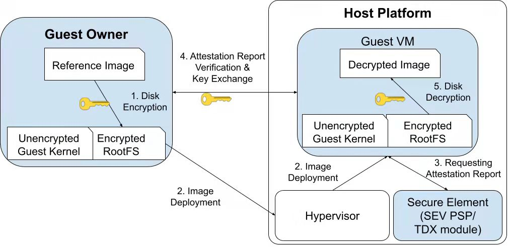

## Components

The project includes several components. The first one is the jindisksetup command line tool used to conveniently setup the dm-jindisk kernel module, which works as a device mapper and provides transparent encryption of block devices. Secondly, we make an initramfs hook that should be called to decrypt the encrypted image when the guest VM is booted. The third is a tool designed for guest owner to transform its own reference image to a JinDisk-protected image. Lastly, we put some examples here to demonstrate how this toolchain helps building a confidential VM with corresponding (SEV/TDX) Remote Attestation procedures.

### jindisksetup

jindisksetup is the command line interface for creating, accessing and managing encrypted JinDisk devices. Just like dm-jindisk is an alternative of dm-crypt, jindisksetup is as a counterpart to cryptsetup. 

### Initramfs Hooks

Initramfs hook is a early stage service (in guest kernel's initram image) we developed for decrypting the root filesystem when the guest kernel is loaded. This hook can be set to execute decryption after fstab mount. The key to decrypt the root partition is retrieved from the RA (Remote Attestation) protocol, i.e., the RA procedure will perform key exchange between the guest kernel and the guest owner. Note that the RA procedure can be implemented as a pluggable module according to corresponding RA protocols.

### Guest Owner Tool

This Guest Owner tool will also include the abovementioned initramfs hook(s) into the output image for automatically unlocking a JinDisk partition at the early stage of boot time.

## Examples integrated with RA

Remote attestation is necessary to let the confidential computing user (client/Guest Owner in VM-based TEE environment) trust the code running on a remote cloud. 

RA procedures can be integrated into JinDisk-Setup by replacing different RA implementations lying in the initramfs hooks (or any early stage systemd services). To integrate RA more conveniently, the sub-procedure of retrieving the attestation reports/certificates and the sub-procedure of how disk encryption/decryption key is exchanged can be implemented modularly. 

# Detailed Workflow

The following diagram shows the high-level workflow and component relationships.

The workflow of JinDisk-Setup can be described as five steps.

- Step 1: We use the guest-owner-tool to generate a protected guest image from a base image. 

- Step 2: The GO uses Qemu/KVM to launch a secure VM.

- Step 3: The initramfs hook requests the attestation report when the kernel is booted.

- Step 4: The initramfs hook sends the attestation report to GO and gets back the disk encryption/decryption key.

- Step 5: The initramfs hook decrypts guest VM's root filesystem with the disk encryption/decryption key.

## Guest Owner Setup

This is the Step 1 - guest disk encryption. Specifically, we prepare image and put an encrypted (JinDisk-formatted) partition into it.

The first thing is to create a new image, which includes an EFI partition, a boot partition and the most important - a root partition. To protect the root partition, the guest owner tool will then encrypt it using JinDisk's data encryption scheme. The encryption key should be stored in a safe place and be managed properly. The tool will also set up necessary execution enviroment for later Guest Disk Unlocking and the component (the initramfs hook) to do it.

After that, GO can launch the secure VM through a TEE-supported VMM (such as Qemu). The VMM will help calculating the measurement of the guest VM's kernel and reported to GO, to ensure that GO is launching an expected VM image.

## Guest VM Setup

To fully set up a confidential VM is not easy. It involves complex encryption complicated among multiple parties. Guest Disk Unlocking is the main goal of the initramfs hook. But, before unlocking the root filesystem, the root partition should be mounted automatically during the kernel boot.

Then, initramfs hook invokes the functions in jindisksetup, to open the JinDisk-formatted root partition.

## Portable RA

Various remote attestation protocols can be integrated into this JinDisk-Setup project.

Here we first brief how JinDisk-Setup works with RA. For example in SEV-SNP, a guest VM can makes use of the proposed SEV-SNP support to obtain an attestation report via the `sevguest.ko` and `ccp.ko`  kernel modules. The ccp.ko module can optionally store the VCEK certificate for the platform along with the certificate chain necessary to validate the VCEK certificate.  This guest kernel driver is responsible for sending the SNP_GUEST_REQUEST message to the ASP firmware and presenting the reply back to user space.

 The attestation report can then be sent to the Guest Owner.

The Guest Owner can retrieve the certificate chain necessary to validate the attestation report signature. If the verification is passed, a trusted communication channel then can be built.

Later the disk encryption key can be transmitted to the guest VM via the trusted channel.

This procedure can be portable as long as the Step 3 and Step 4 are modular. If the Intel TDX also uses such similar measurement hash (like SEV's attestation report) for GO to verify, then the Step 3 can be replaced with retrieving any other corresponding certificates. And Step 4 can be implemented as a protocol like RA-TLS. In this case, the establishment of secure channel could be standard and portable.
